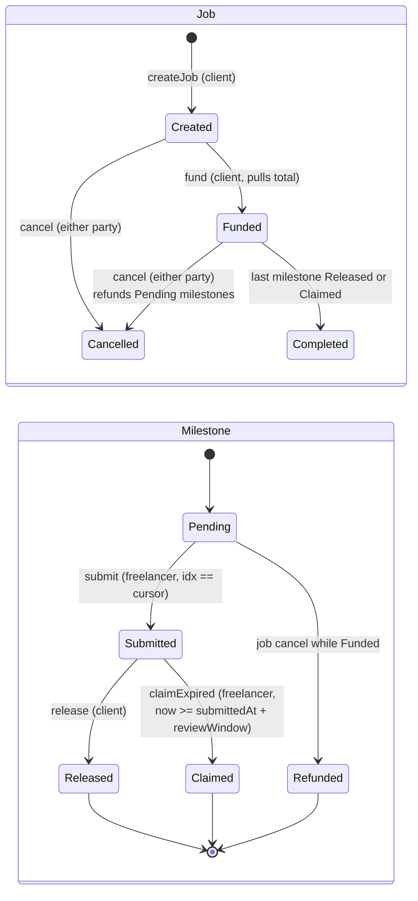

# MilestoneEscrow

[](https://github.com/danolekh/milestone-escrow/actions/workflows/ci.yml)
[](LICENSE)
[](src/MilestoneEscrow.sol)

A small, ownerless USDC escrow for freelance work on Base. The client locks the whole budget up front, split into
milestones; the freelancer delivers one milestone at a time; the client releases it, or — if the client goes quiet —
the freelancer collects it after a fixed review window. Either side can cancel the not-yet-started remainder and the
client gets it back. No admin key, no upgrade path, no fee, no arbitrator: the only things that can move money are the
two parties and the clock.

## State machine



Milestones are strictly sequential: `submit`, `release` and `claimExpired` all require `idx == cursor`, where `cursor`
is the first milestone that is neither Released nor Claimed. At most one milestone is under review at any time. This
keeps the state machine tiny and makes the refund on cancel unambiguous. A milestone that is already `Submitted` when
the job is cancelled is untouched: the client can still release it and the freelancer can still claim it.

## Functions

| Function | Caller | Precondition | Effect |
| --- | --- | --- | --- |
| `createJob(freelancer, token, amounts[], reviewWindow)` | anyone (becomes client) | `amounts` non-empty, each > 0; `reviewWindow` in [1 h, 90 d]; freelancer != client | New job in `Created`; returns sequential `jobId` |
| `fund(jobId)` | client | job `Created`; prior ERC-20 approval | One `safeTransferFrom` of the total; job `Funded`; reverts `UnsupportedToken` if the balance delta != total |
| `submit(jobId, idx)` | freelancer | job `Funded`; `idx == cursor`; milestone `Pending` | Milestone `Submitted`, `submittedAt = now` |
| `release(jobId, idx)` | client | job `Funded` or `Cancelled`; `idx == cursor`; milestone `Submitted` | Pays freelancer; milestone `Released`; cursor++ |
| `claimExpired(jobId, idx)` | freelancer | as `release`, plus `now >= submittedAt + reviewWindow` | Pays freelancer; milestone `Claimed`; cursor++ |
| `cancel(jobId)` | client or freelancer | job `Created` or `Funded` | Job `Cancelled`; every `Pending` milestone becomes `Refunded` and their sum goes to the client (zero transfer if nothing pending) |
| `getJob(jobId)` | view | — | client, freelancer, token, reviewWindow, status, cursor, milestoneCount, total |
| `milestone(jobId, idx)` / `getMilestones(jobId)` | view | — | amount, submittedAt, status |
| `fundedUnreleased(jobId)` | view | — | Tokens the escrow holds for this job |
| `jobCount()` | view | — | Number of jobs ever created |

When the last milestone is released or claimed on a `Funded` job, the job becomes `Completed`. A job that was
cancelled stays `Cancelled` even after its in-review milestone resolves.

**Accounting invariant.** For every token, `token.balanceOf(escrow)` equals the sum of `fundedUnreleased(jobId)`
over all jobs using that token (as long as nobody sends tokens to the contract directly). The invariant suite checks
this after every random call sequence, against both the contract's own view and independent ghost accounting.

## What it does not do

- **No arbitration.** If the client rejects work, the only outcomes are: client releases anyway, client waits and the
  freelancer claims after the window, or one side cancels the remaining milestones. Disputes are resolved off-chain.
- **No partial releases.** A milestone is paid in full or not at all. Split the work into more milestones instead.
- **No adding or editing milestones** after creation. Create a new job.
- **No fee-on-transfer or rebasing tokens.** `fund` measures the balance delta and reverts if it differs from the
  requested amount. Rebasing tokens that change balances after funding will break the accounting invariant.
- **No ETH.** ERC-20 only.
- **Not audited.** Tested (unit, fuzz, invariant, fork) with Slither in CI, but no third-party review.

## Threat model

| Concern | Mitigation |
| --- | --- |
| Reentrancy via a malicious/hooked token | `nonReentrant` on every function that moves tokens, plus checks-effects-interactions (status and cursor are updated before any transfer). A test re-enters `release` and `cancel` from inside the token transfer and asserts `ReentrancyGuardReentrantCall`. |
| Paying a milestone twice / skipping one | Single `cursor` per job; payout only for the milestone at the cursor and only from `Submitted`; cursor advances atomically with the status change. Invariant `noDoublePayout` tracks payouts per (job, idx). |
| Timestamp manipulation of the review window | `claimExpired` uses `block.timestamp >= submittedAt + reviewWindow`. Sequencers can nudge timestamps by seconds; the 1-hour minimum window makes that immaterial. `submittedAt` is set by the contract, not the caller. |
| Client never reviews | Freelancer claims after the window. The window is fixed at creation and cannot be extended by the client. |
| Freelancer never submits (griefing the client's locked funds) | Either party can `cancel`; all `Pending` milestones are refunded immediately. Only a milestone the freelancer has actually submitted stays locked, and only for at most one review window. |
| Client cancels right after a submission | The submitted milestone is excluded from the refund and remains releasable/claimable. The freelancer never loses work that was submitted. |
| Token approval race / front-running `fund` | `fund` pulls exactly `total` from `msg.sender` (the client) to the escrow; nobody else can trigger the pull or redirect it. Approve exactly `total` rather than unlimited if you prefer. |
| Fee-on-transfer / deflationary tokens leaving the escrow undercollateralised | Balance-delta check in `fund` reverts with `UnsupportedToken`. |
| Wrong token or zero addresses | Zero token / zero freelancer / client == freelancer revert at creation. The token contract itself is not validated beyond that; use a known token. |
| Unbounded loops | `cancel` and `fundedUnreleased` iterate the milestone array from the cursor. The array is set once in `createJob`, whose own gas cost bounds it. |
| Griefing by direct token transfers | Tokens sent directly to the escrow are simply stuck; they do not affect any job's accounting. |

## Deployed addresses

| Network | Address |
| --- | --- |
| Base Sepolia (84532) | pending |
| Base mainnet (8453) | pending |

## Development

Requires [Foundry](https://book.getfoundry.sh/) (tested with 1.5). Dependencies are git submodules.

```bash
git clone --recurse-submodules git@github.com:danolekh/milestone-escrow.git
cd milestone-escrow
forge build --sizes
forge test                      # unit + fuzz + invariant
FOUNDRY_PROFILE=ci forge test   # 2000 fuzz runs, 256x64 invariant runs
forge coverage --report summary --no-match-coverage "(test|script)"
```

The fork test (`test/fork/BaseSepolia.t.sol`) runs against the real USDC on Base Sepolia and is skipped unless
`BASE_SEPOLIA_RPC_URL` is set:

```bash
BASE_SEPOLIA_RPC_URL=https://sepolia.base.org forge test --match-path test/fork/*
```

### Coverage

`forge coverage --report summary --no-match-coverage "(test|script)"`, Foundry 1.5.0:

| File | Lines | Statements | Branches | Functions |
| --- | --- | --- | --- | --- |
| `src/MilestoneEscrow.sol` | 100.00% (120/120) | 100.00% (167/167) | 100.00% (28/28) | 100.00% (15/15) |

Test suite: 72 unit/fuzz tests, 5 invariants (each 64 runs × 32 calls by default), 3 fork tests.

### Deploying

Signing uses an encrypted Foundry keystore; no private key is ever read from `.env`.

```bash
cp .env.example .env                       # RPC URLs + Etherscan key only
cast wallet import deployer --interactive  # paste the deployer key once; stored encrypted
make deploy-sepolia                        # forge script ... --account deployer --broadcast --verify
make deploy-base
make verify ADDRESS=0x...                  # re-verify an existing deployment (Etherscan v2 API)
```

Verification uses the Etherscan v2 endpoint (`https://api.etherscan.io/v2/api?chainid=84532` / `8453`) with a single
`ETHERSCAN_API_KEY`.

## Layout

```
src/MilestoneEscrow.sol              the contract
test/MilestoneEscrow.t.sol           unit + fuzz tests
test/invariant/                      stateful fuzzing (handler + invariants)
test/fork/BaseSepolia.t.sol          real-USDC fork test
test/mocks/                          MockUSDC, FeeOnTransferToken, ReentrantToken
script/Deploy.s.sol                  deployment script
slither.config.json                  static-analysis config used in CI
```

A `frontend/` for creating and tracking jobs is planned as the next step.

## License

MIT © 2026 Daniil Olekh
